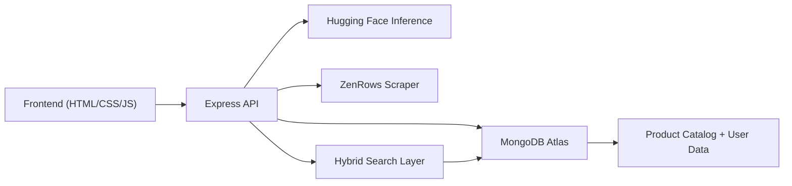

# EcoFi

EcoFi is a full-stack sustainable shopping platform that helps users discover eco-conscious products with a cleaner and more transparent buying experience.

It combines a responsive frontend, secure user authentication, wishlist management, profile settings, and backend-powered product discovery (including semantic search support).

## Key Features

- User authentication with JWT (`Sign up`, `Login`, `Profile`, `Change password`, `Delete account`)
- Product discovery by category, subcategory, and sorting options
- Wishlist management (add/remove products per user account)
- Hybrid search pipeline using vector search, fuzzy lexical fallback, and alias expansion
- Paginated search UI with recent searches, popular search chips, loading states, and relevance badges
- Admin tools UI for single product ingestion, bulk import, and controlled deletion flows
- Admin ingestion endpoints for adding/removing products from multiple marketplaces
- Responsive UI with mobile-friendly navigation and account settings sidebar

## Tech Stack

- Frontend: HTML, CSS, Vanilla JavaScript
- Backend: Node.js, Express
- Database: MongoDB + Mongoose
- Auth/Security: JWT, bcryptjs
- Integrations: Hugging Face Inference API, ZenRows scraping API

## Project Structure

- `index.html`: Main app layout
- `style.css`: Styling and responsive behavior
- `script.js`: Client-side app logic and API integration
- `images/`: Static assets
- `backend/server.js`: Express API server
- `backend/models/`: Mongoose models (`User`, `Product`)
- `tests/smoke.test.js`: Smoke tests for core wiring
- `render.yaml`: Render deployment config for backend
- `vercel.json`, `netlify.toml`: Static frontend deployment configs

## Architecture



## Getting Started

### 1. Prerequisites

- Node.js 18+ (Node 22 is supported)
- MongoDB Atlas or local MongoDB instance

### 2. Backend Setup

```bash
cd backend
copy .env.example .env
npm install
node server.js
```

Required `backend/.env` variables:
- `MONGO_URI`
- `JWT_SECRET`
- `ADMIN_SECRET_KEY`
- `HF_API_KEY`
- `ZENROWS_API_KEY`
- `CORS_ORIGIN` (`*` for local dev, frontend URL in production)
- `PORT` (optional, default `4000`)

### 3. Frontend Setup

Open `index.html` in your browser.

Default backend URL is `http://localhost:4000`.

To point frontend to a deployed API:

```js
localStorage.setItem("ecofi_api_base_url", "https://your-backend.onrender.com");
```

Then reload the page.

## API Overview

Core routes:
- `POST /api/signup`
- `POST /api/login`
- `GET /api/profile`
- `PATCH /api/profile/details`
- `POST /api/auth/change-password`
- `DELETE /api/profile`
- `GET /api/products`
- `GET /api/wishlist`
- `POST /api/wishlist/toggle`

Admin routes:
- `POST /api/admin/addproduct`
- `POST /api/admin/add-bulk`
- `POST /api/admin/remove-products`

Response notes:
- `GET /api/products` now returns `products` plus `meta` (`page`, `pageSize`, `total`, `totalPages`, `searchSource`)
- Search can return results from `semantic`, `fuzzy`, `keyword`, or `catalog` modes

## Deployment

### Backend (Render)

This repository includes `render.yaml` for backend deployment.

Set these secrets in Render:
- `MONGO_URI`
- `JWT_SECRET`
- `ADMIN_SECRET_KEY`
- `HF_API_KEY`
- `ZENROWS_API_KEY`
- `CORS_ORIGIN` (your frontend domain)

### Frontend (Netlify, Vercel, or GitHub Pages)

- Deploy the project root as a static site
- Configure API base URL using `localStorage` or a custom bootstrap script
- `vercel.json` and `netlify.toml` are included for zero-config static deployment

## Testing

Run smoke tests:

```bash
cd backend
npm run test:smoke
```

What the tests currently cover:
- portable asset paths
- API URL indirection
- presence of core backend routes
- presence of search/admin UI wiring

## Future Improvements

- Add role-based admin authentication middleware
- Add pagination and caching for product listing
- Add CI pipeline for automated linting/testing
- Add end-to-end browser tests for auth and wishlist flows
